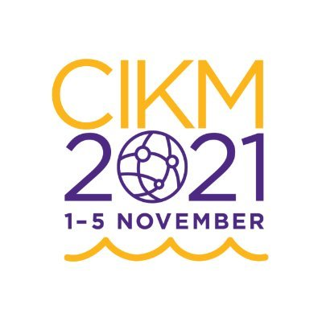

# 1st Solution to QQ Browser 2021 AIAC Track 2

This repository is the winning solution to QQ Browser 2021 AI Algorithm Competition
Track 2 Automated Hyperparameter Optimization (CIKM AnalytiCup 2021).

**Team:** PKU-DAIR. **Members:** Huaijun Jiang, Yu Shen, Yang Li.

The solution is based on black-box optimization system [**OpenBox**](https://github.com/PKU-DAIR/open-box).

<p align="center">




</p>

## Links

* Technical Report on [arXiv](https://arxiv.org/abs/2111.00513).
* Presentation (Presented by Yu Shen): [Slides](https://pcg-kandian-alg-race-1251316161.cos.ap-guangzhou.myqcloud.com/ws/topic2/AIAC_CIKM2021_Track2_1st_PKU-DAIR/PKU-DAIR_slide.pdf), [Video](https://pcg-kandian-alg-race-1251316161.cos.ap-guangzhou.myqcloud.com/ws/topic2/AIAC_CIKM2021_Track2_1st_PKU-DAIR/PKU-DAIR_video.mp4).

-----

* Official website：[QQ Browser 2021 AI Algorithm Competiton](https://algo.browser.qq.com/#en) / [QQ浏览器2021AI算法大赛](https://algo.browser.qq.com/)
* Contest manual：[Automated Hyperparameter Optimization Contest manual](https://docs.qq.com/doc/p/9b3e04cecb9631e393e4316d4b10eaa781b5fd61?dver=2.1.27141849) / [自动超参数优化参赛手册](https://docs.qq.com/doc/p/681e40251e75740c654289ddfb827b7571107693?dver=2.1.27141849)
* The preliminary stage：
  * Code repository：[THPO-Kit Github](https://github.com/QQ-Browser-AI-Algorithm-Competition/THPO_Kit_2021)
  * API reference & ranking rules：[Introduction to THPO-Kit](https://docs.qq.com/doc/p/f274d4d7a1e666b652048b72fb6d3a946ed18c7f?dver=2.1.27141849) / [THPO-Kit 介绍文档](https://docs.qq.com/doc/p/ab5c751cdc66a2f7abde4a3701ce375dd56ea713?dver=2.1.27141849)
* The final stage：
  * Code repository：[THPO-Final-Kit Github](https://github.com/QQ-Browser-AI-Algorithm-Competition/THPO_Final_Kit_2021)
  * API reference & ranking rules：[THPO-final-Kit 介绍文档](https://docs.qq.com/doc/p/91cf1a0033fff380993379ddee9635a474579752?dver=2.1.27211085)

## Repo structure

```
|--THPO_Kit_2021                # code for preliminary stage
|  |--pku_dair_openbox          # our solution
|  |--...
|
|--THPO_Final_Kit_2021          # code for final stage
|  |--pku_dair_openbox_final    # our solution
|  |--explore_data              # code for data exploration
|  |--...
|
|--docs                         # documents
|  |--...
|
|--README.md                    # this file
`--requirements.txt             # requirements
```

**Note:** We provide code for data exploration and documents in this repo.

## Environment

+ python=3.6.8

```shell
conda create -n thpo python=3.6.8
```

+ openbox==0.7.16

```shell
pip install -r requirements.txt
```

+ Evaluation machine environment: linux 4.14, 64-bit operating system, memory 4G,
CPU 2.3GHz dual-core Intel Core i5.

## Usage

### Preliminary Stage

```shell
cd THPO_Kit_2021
```

Local test:

```shell
./local_test.sh pku_dair_openbox
```

Submission:

```shell
./prepare_submission.sh pku_dair_openbox
```

### Final Stage

```shell
cd THPO_Final_Kit_2021
```

Local test:

```shell
./local_test.sh pku_dair_openbox_final
```

Submission:

```shell
./prepare_submission.sh pku_dair_openbox_final
```

Please see `README.md` in inner folders for more details.
